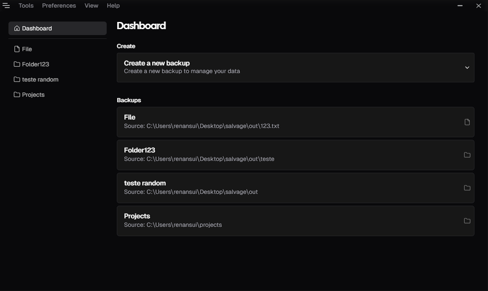
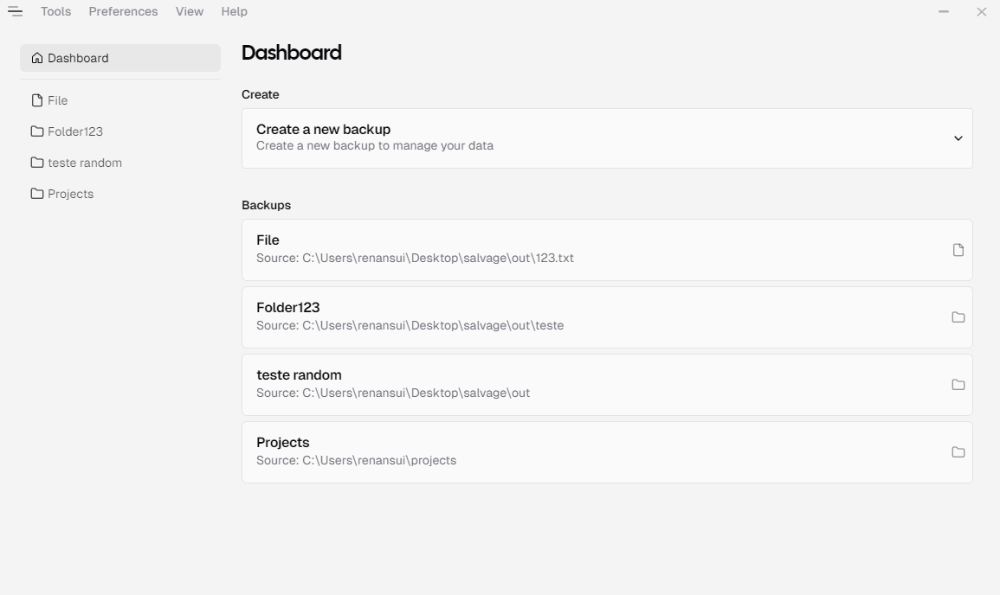

<div align="center">
  
</div>

<p align="center">Copy files comfortably and automate your backups.</p>
<p align="center">Bootstrapped with <a href="https://tauri.app/v1/guides/getting-started/setup/" target="_blank">create-tauri-app</a> </p>

[](https://github.com/RenanSui/salvage)

[](https://github.com/RenanSui/salvage)

## Tech Stack
- **Frameworks:** [Next.js](https://nextjs.org) + [Tauri](https://tauri.app)
- **Styling:** [Tailwind CSS](https://tailwindcss.com)
- **Components Library:** [Shadcn UI](https://ui.shadcn.com)
- **Form:** [React Hook Form](https://react-hook-form.com)
- **Toaster:** [Shadcn UI's Toaster](https://ui.shadcn.com/docs/components/toast)
- **File Watcher:** [Notify](https://github.com/notify-rs/notify)

## Features
- Automatically monitor files
- Copy monitored files when changes occur
- Create a List of Exclusions
- Monitor Logs

## Running Locally
1. Follow the [Tauri Prerequisites](https://tauri.app/v1/guides/) guide and install Rust and Tauri

2. Clone the repository

   ```bash
   git clone https://github.com/RenanSui/salvage.git
   ```

3. Install dependencies using pnpm

   ```bash
   pnpm install
   ```

4. Start the development server

   ```bash
   pnpm tauri dev
   ```
5. Build for production
 
   ```bash
   pnpm tauri build
   ```

## How do I deploy this?

Follow the deployment guides for [Tauri](https://tauri.app/v1/guides/) for more information.

## License

Licensed under the MIT License. Check the [LICENSE](./LICENSE) file for details.
