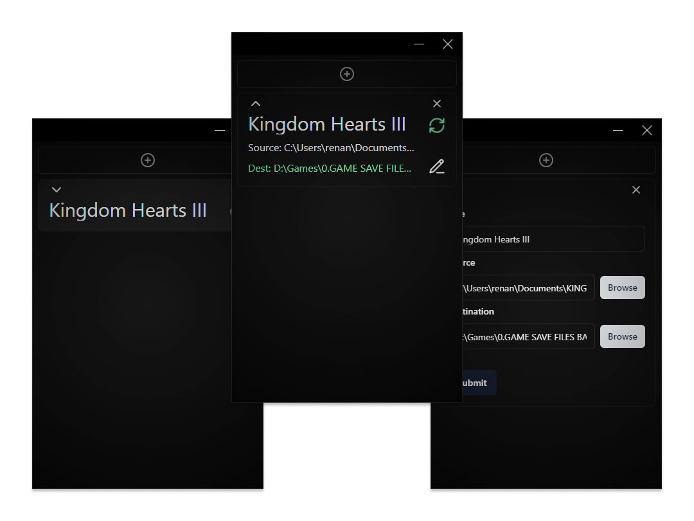

<div align="center">
  
</div>
<div align="center">
  
</div>

<p align="center">Simple Backup Automator.</p>

---

- [Overview](#overview)
- [Install](#install)
  - [Download](#download)
- [Development](#development)
  - [Build Setup](#build-setup)
- [License](#license)

## Overview

Salvage is a simple Backup Automator. It aims to provide a visually-pleasing and reliable way to safely store your files in another device or folder.

## Install

### Download

Download the latest version from the [releases](https://github.com/RenanSui/salvage/releases) page.

Salvage is available for Windows.

## Development

Salvage is built with [React](https://github.com/facebook/react), [Electron](https://github.com/electron/electron), and [electron-vite](https://github.com/electron-vite/electron-vite-react).

### Build Setup

```bash
# install dependencies
npm i

# serve with vite hot reload at localhost:5173
npm run dev

# build Salvage for production
npm run build:win
```

## License

MIT &copy; [Renan Sui](https://github.com/RenanSui)
